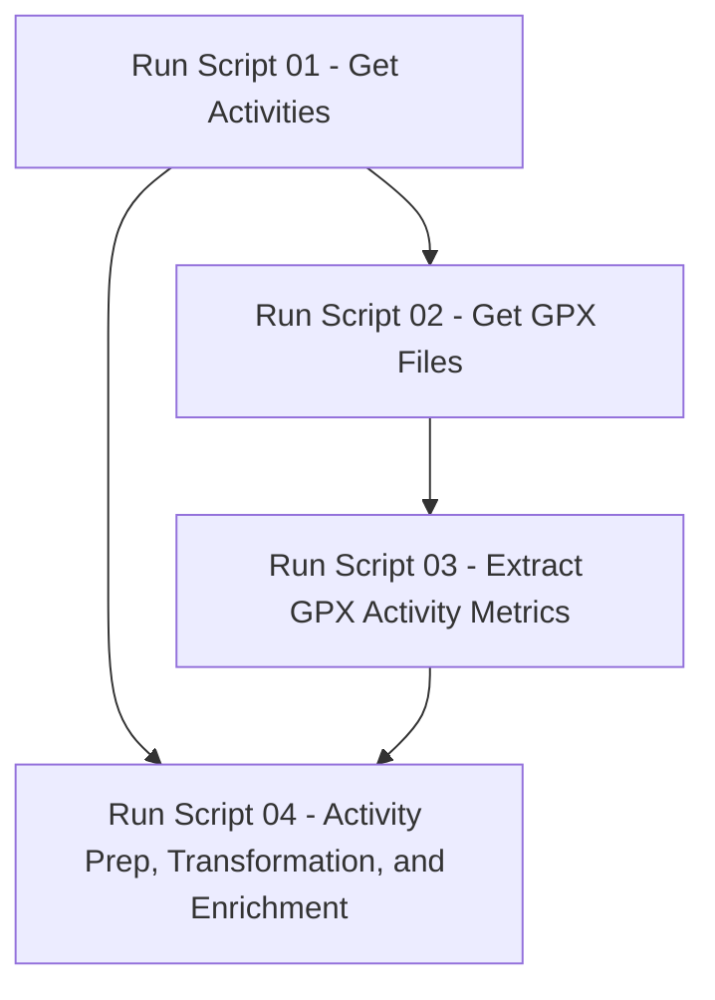

<h1>
    <p align="center">Garmin Connect Activities</p>
</h1>

## Overview
This repository contains scripts to retrieve and analyze activity data from Garmin Connect. The goal is to provide a way to download, process, and visualize workout data for personal insights and tracking performance over time.

## Features
- Fetch activity data from Garmin Connect
- Process and analyze fitness data
- Export data in user-friendly formats
- Generate summary statistics and visualizations

## Prerequisites
Ensure you have the following installed before using the scripts:
- Python 3.x
- Required Python packages (listed in `requirements.txt`)

## Installation
1. Clone the repository:
   ```sh
   git clone https://github.com/bhyman67/Garmin-Connect-Activities.git
   cd Garmin-Connect-Activities
   ```
2. Install dependencies:
   ```sh
   pip install -r requirements.txt
   ```

## Scripts / Usage

### Script Descriptions
1. Get Activities
   - Authenticate with [Garmin Connect](https://pypi.org/project/garminconnect/)
   - Fetch recent activities
   - Save activities data to a pickle file
   - Handle connection and authentication errors
2. Get GPX Files
3. Extract GPX Activity Metrics from GPX files
4. Activity Prep, Transformation, and Enrichment

### Usage

There are two ways to run these scripts. Either all of them sequentially. Or only the first and then the last if you want to skip the GPX piece. 



<p align="right">Click <a href="https://github.com/bhyman67/Garmin-Connect-Activities">here</a> to view the code in this project's repository<p>